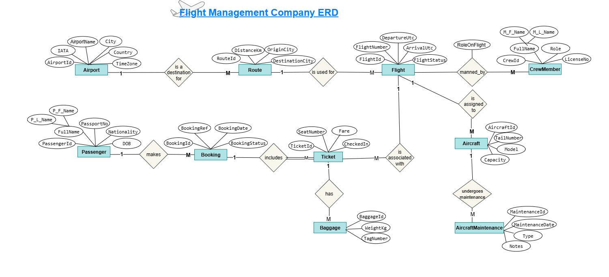

# Flight Management Company

  ## 📜Project Summary: 
  Build a Flight Management System (FMS) backend for a company that manages flights, aircraft, crews, bookings, 
passengers and airports — implemented using layered architecture, EF Core, Repository pattern, and LINQ.

##   🎯Learning Goals: 
• Design and document an ERD and relational schema. 

• Implement EF Core models with annotations and relationships. 

• Implement layered architecture: Presentation / Service / Repository / Data (DbContext). 

• Implement per-entity repositories exposing essential CRUD + query methods. 

• Write LINQ queries: joins, groupings, aggregations, partitioning, projection to DTOs, hierarchical queries

 ## 🗂️ Business Domain & ERD (entities + relationships):

 ### 1) Entities (core): 

☑️ Airport 

• AirportId (int PK) 

• IATA (string, 3, unique) 

• Name (string) 

• City (string) 

• Country (string) 

• TimeZone (string) 

☑️ Aircraft 

• AircraftId (int PK) 

• TailNumber (string, unique) 

• Model (string) 

• Capacity (int) 

☑️ CrewMember 

• CrewId (int PK) 

• FullName (string) 

• Role (enum/string) — Pilot/CoPilot/FlightAttendant 

• LicenseNo (string, nullable) 
 
☑️ Route 

• RouteId (int PK) 

• DistanceKm (int) 

☑️ Flight 

• FlightId (int PK) 

• FlightNumber (string) — e.g., "FM101"

• DepartureUtc (DateTime) 

• ArrivalUtc (DateTime) 

• Status (string/enum) 

• Note: add unique constraint on (FlightNumber, DepartureUtc.Date) 

☑️ Passenger 

• PassengerId (int PK) 

• FullName (string) 

• PassportNo (string, unique) 

• Nationality (string) 

• DOB (DateTime) 

☑️ Booking 

• BookingId (int PK) 

• BookingRef (string, unique) 

• BookingDate (DateTime) 

• Status (string) 

☑️ Ticket 

• TicketId (int PK) 

• SeatNumber (string) 

• Fare (decimal) 

• CheckedIn (bool) 

☑️ FlightCrew ➔ relationship attributes on many to many 

• RoleOnFlight (string) 

• Primary Key (FlightId, CrewId) 
 
☑️ Baggage 

• BaggageId (int PK) 

• TicketId (FK → Ticket) 

• WeightKg (decimal) 

• TagNumber (string) 

☑️ AircraftMaintenance 

• MaintenanceId (int PK) 

• MaintenanceDate (DateTime) 

• Type (string) 

• Notes (string)

### 2) ERD 

### 3) Mapping 

### 3) Normlization 

**Step 1**  — First Normal Form (1NF) Becouse of the following reasons, the database is already in 1NF:

Each table has a primary key.
Each column contains atomic values.
No repeating groups are visible.

**Step 2** — Second Normal Form (2NF) The database is already in 2NF because:

All non-key attributes are fully functionally dependent on the primary key.
There are no partial dependencies of any column on the primary key.
All non-key attributes are dependent on the entire primary key.
There are no transitive dependencies.

**Step 3** — Third Normal Form (3NF) The database is already in 3NF because:

There are no transitive dependencies.
All non-key attributes are dependent only on the primary key.

### 📊What are Data Transfer Objects (DTOs)?

DTO stands for Data Transfer Object. It is a design pattern used in programming applications to simplify the process of transferring data between different layers of an application, such as transferring data from the database layer to the front-end layer or vice versa.

Simply put, a DTO is an object (class) that contains only properties and no behaviors or business logic. Its primary purpose is to group data into a single object to facilitate its sending and receiving across a network or between layers.

### Why use DTOs in C# projects? 🤔

Using DTOs has several benefits, especially in projects that use a layered architecture, such as an airline flight management system project:

Separation of Concerns: DTOs separate database models (such as Aircraft or Flight) from models exposed to the user via an API. This prevents internal database details from being leaked to the API.

Performance Improvement: DTOs allow you to choose only the properties you need. For example, instead of sending all the properties of a Passenger object to the front-end, you can create a PassengerDto that contains only FullName and PassportNo, reducing the amount of data transferred.

Data Hiding: You can control the data displayed to the user. If a CrewMember object contains a Salary field, you can create a CrewMemberDto that doesn't contain this field to protect sensitive information.

Preventing Over-Posting Attacks: When you use DTOs for API inputs, you ensure that the user can only submit the data you specify in the DTO, preventing the possibility of unauthorized field updates.